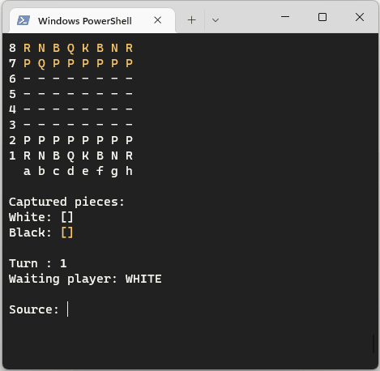
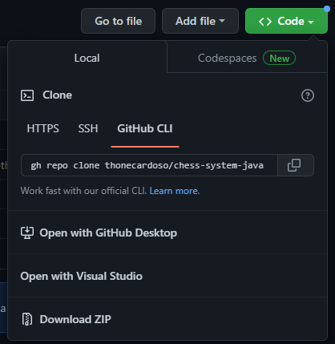
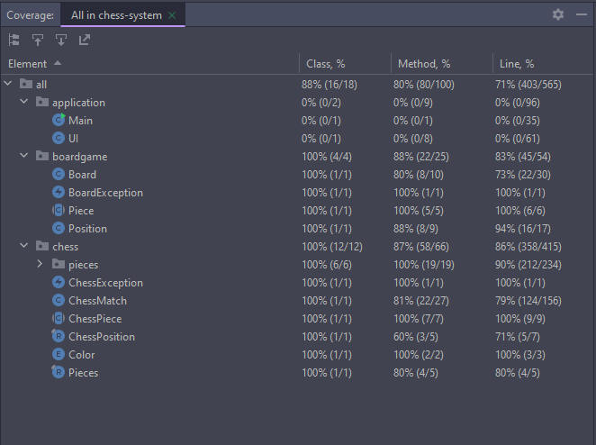

# Chess Game

Console application developed during the  **[Java course](https://www.udemy.com/course/java-curso-completo/)** produced by instructor **[Nelio Alves](https://www.linkedin.com/in/nelio-alves)**.



### Requirements

- Java version 19 or higher.
- Colored terminal like PowerShell used in the exemple.

### How to exec

Download the source or clone the repository.



If your system doesn't have configured Java environment, make the download of **[jdk](https://jdk.java.net/19/)** and set **[Java Path](https://www.geeksforgeeks.org/how-to-set-java-path-in-windows-and-linux/)** according your system.

In your terminal opened in the root path of the project, exec the command to build the projec. 

```bash
javac -sourcepath .\src\main\java\ -d bin .\src\main\java\application\Main.java
```

Run the project

```bash
java -cp .\bin\ .\src\main\java\application\Main.java
```

### How to play

- To move a piece, type the position **column** + **line**, eg: **b2** to select it, after that the game will highlight possible moves from your choice, then select the target position to finish a move.

###### Pieces symbols

| Pawn | Rook | Knight | Bishop | Queen | King |
| :------------------------------------------------------: |:--------------------------------------------------------:| :----------------------------------------------------------: | :----------------------------------------------------------: | :--------------------------------------------------------: | :------------------------------------------------------: |
|                          **P**                           |                          **R**                           |                            **N**                             |                            **B**                             |                           **Q**                            |                          **K**                           |

### Diagram class


### Unit Tests

The project was covered by some unit tests to help with a refactoring, they were also useful to discover some bugs.


###### Code coverage

As the project's main focus wasn't unit tests, it don't cover 100%, but it reached a considerable percentage, covering the main features.

To see the complete coverage report open the **[link](https://thonecardoso.github.io/chess-system-java/)**


